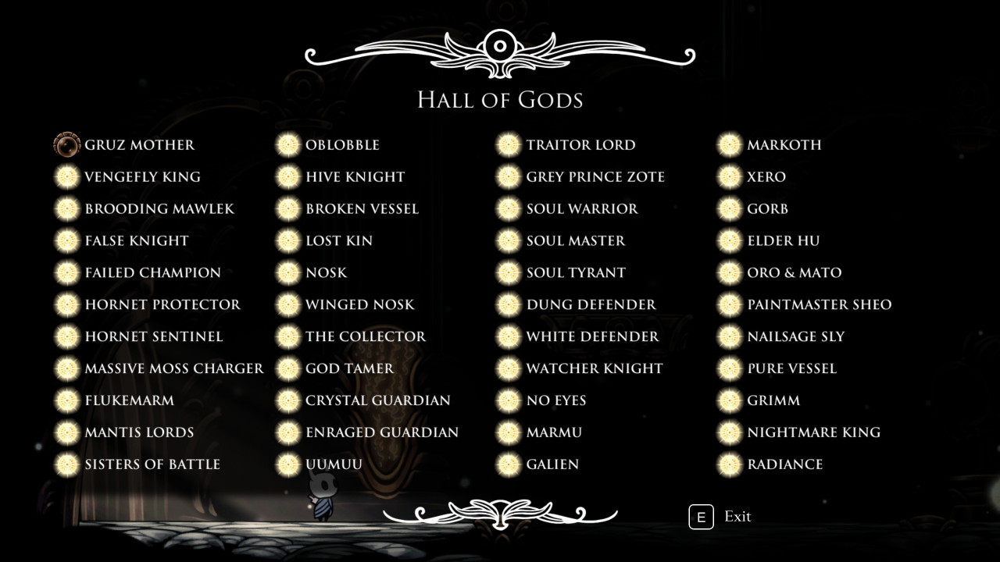

# Hall Of Gods Faker

A small webapp to create a fake completion of the Hall of Gods in Hollow Knight.

## Demo

A demo is available [here](https://fsabre.github.io/hall-of-gods-faker/).

## Features

Click on a symbol to rotate between the available ones (none, attuned, ascended, radiant).

Use the zoom/dezoom function of your browser (probably `Ctrl` + `+`) to show the whole screen, depending on your resolution.

Screenshot manually.

## Usage/Examples



Generate this, then post it on Reddit with the following title :

> omg this boss is so hard I can't any help pwlease ?

And you'll successfully waste everyone's time.

## Run locally

To install this project, run

```bash
  git clone https://github.com/fsabre/hall-of-gods-faker.git
  cd hall-of-gods-faker/
  npm install
  npm run dev
```
